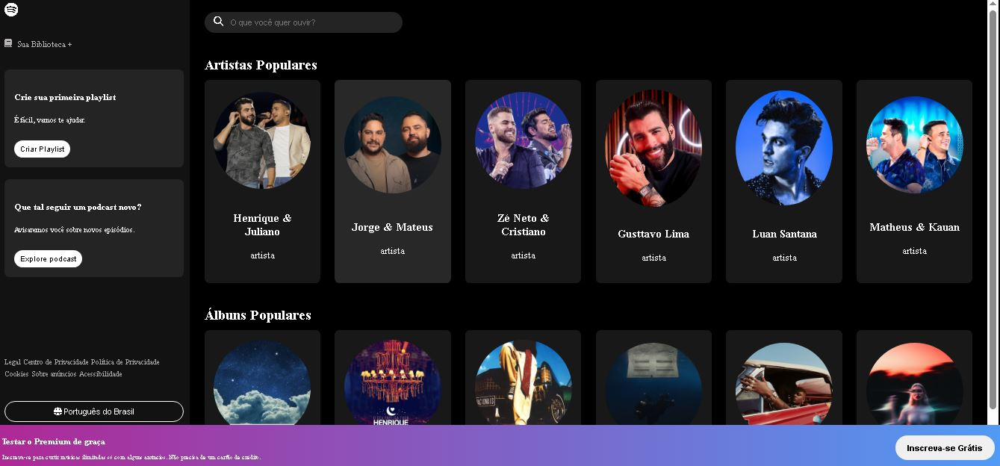

<h1 align="center">🎧 Spotify Clone</h1>

  Interface inspirada no Spotify, feita com HTML, CSS e JavaScript puro.  
  Projeto focado em responsividade, layout moderno e prática de front-end.

---

## 🖼 Visual do Projeto

  

---

## 🚀 Acesse o Projeto Online

🔗 [Clique aqui para ver publicado no GitHub Pages](https://jeanhenrique2.github.io/Spotify/)

---

## 🛠 Tecnologias utilizadas

 
  
  
  

---

## 📱 Redes Sociais

  
  

---

## ✉ Contato

📬 Me mande um e-mail: *jean_henrique2@hotmail.com*
